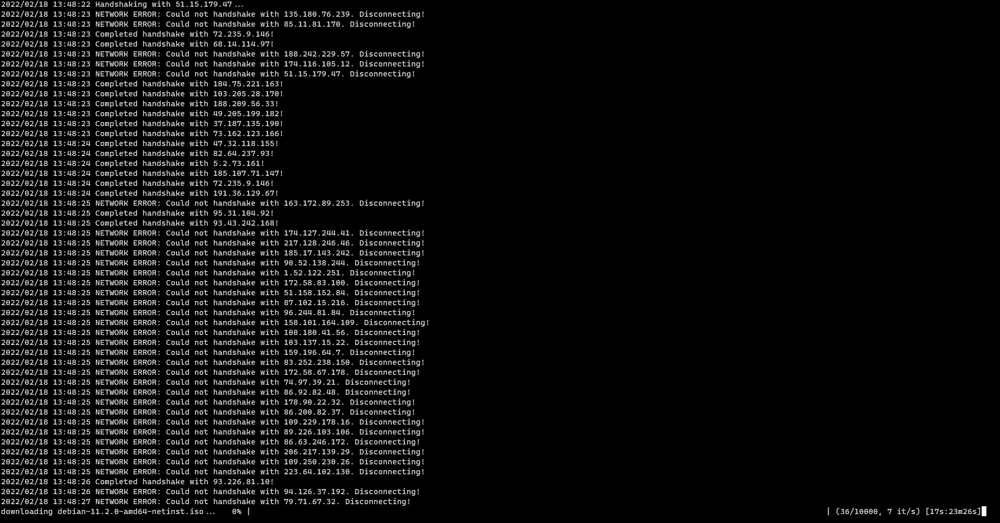

# goMule
一个用 go 实现的 torrent 客户端，基于 go 1.18

## 原理

其他原理性部分可参考 [wiki BitTorrent Specification](https://wiki.theory.org/index.php/BitTorrentSpecification)

### 解析种子文件
1. 种子文件编码

种子文件编码类型是 `Bencode  编码`，这个编码类型虽然比纯二进制编码效率低，但是由于它结构简单，并且也不会被字节序列所影响(整数数字表示是十进制)，对于需要建立 *跨平台* 应用的 `BitTorrent` 来讲就显得十分合适。在兼容性方面，由于采用的是 *字典结构*，只要注意下字典 key 的冲突，加新的 key 都是没大问题的，所以兼容性也非常强

2. 种子文件编码规则和结构

一般种子的文件编码和结构是类似于下面这样

```
d
  8:announce
    41:http://bttracker.debian.org:6969/announce
  7:comment
    35:"Debian CD from cdimage.debian.org"
  13:creation date
    i
      1639833767
    e
  9:httpseeds
    l
      145:https://cdimage.debian.org/cdimage/release/11.2.0//srv/cdbuilder.debian.org/dst/deb-cd/weekly-builds/amd64/iso-cd/debian-11.2.0-amd64-netinst.iso
      145:https://cdimage.debian.org/cdimage/archive/11.2.0//srv/cdbuilder.debian.org/dst/deb-cd/weekly-builds/amd64/iso-cd/debian-11.2.0-amd64-netinst.iso
    e
  4:info
  d
    6:length
      i
        396361728
      e
    4:name
      31:debian-11.2.0-amd64-netinst.iso
    12:piece length
      i
        262144
      e
    6:pieces
      30240:^U���...(一堆 hash 过后的数据)
  e
e
```

- 以 `d` 开头以 `e` 结尾的表示 `dictionaries` 即 **字典**，它的格式就是

  ```
  d
    <bencoding 字符串>
    <bencoding 编码类型>
  e
  ```
- <bencoding 字符串> 的格式为

  ```
  <字符串长度>:<字符串>
  ```

  比如上面的

  ```
  8:announce
  ```

- <bencoding 编码类型> 包括了 字典、字符串、列表、整数 这些
- 以 `l` 开头以 `e` 结尾的表示 `list` 即 *列表*，它的格式就是

  ```
  l
    <bencoding 编码类型>
  e
  ```

  比如上面的

  ```
  l
    145:https://cdimage.debian.org/cdimage/release/11.2.0//srv/cdbuilder.debian.org/dst/deb-cd/weekly-builds/amd64/iso-cd/debian-11.2.0-amd64-netinst.iso
  e
  ```
- 以 `i` 开头以 `e` 结尾的表示 `integer` 即 *整数*，它的格式就是

  ```
  i<整数>e
  ```

  比如上面的

  ```
  i
    1639833767
  e
  ```

由上面可以看到整个种子文件就是一个以 `Bencode 编码` 为基础的，一个很大的 *字典*

对于整个文件的结构而言，需要关注下面几个关键字

- `announce`: 表示 `tracker` 服务器的 URL
- `comment`(可选): 表示备注
- `creation date`(可选): 表示种子创建的时间，格式为 Unix 标准时间格式
- `info`: 表示文件的主要信息，里面是一个字典结构，里面可能有一个文件，也可能有多个文件


对于本项目而言，`info` 里面包含了

- `length`: `debian-11.2.0-amd64-netinst.iso` 文件的大小为 *396361728* byte
- `name`: `debian-11.2.0-amd64-netinst.iso` 文件的名称
- `piece length`: `debian-11.2.0-amd64-netinst.iso` 文件被分成了 *262144* 个 `piece`
- `pieces`: 每个 `piece` 的二进制 blob 数据经过 hash 过后的集合

而客户端所做的工作，就是把这些 `pieces` 从各路 `peers` 那里下载到本地，根据种子里面的信息对每个 `piece` 做 hash 校验，最后合并成一个 `debian-11.2.0-amd64-netinst.iso` 的过程

### 下载种子文件对应的文件

1. 发送请求

- 首先需要构建一个请求 tracker 服务器的 URL，发送 get 请求，需要在类似于这种 tracker URL `http://bttracker.debian.org:6969/announce` 后面加上 `info_hash`，`peer_id`，`port`，`uploaded`，`downloaded`，`compact`，`left` 这类的参数
- `info_hash`: 就是将种子文件中 `info` 对应的内容转换成 *byte* 后再对其进行 sha1 hash 后的结果
- `peer_id`: 就是 `peer` 的 id，这个是随机生成的
- `port`: 客户端监听的端口号，这个端口号是为 BitTorrent 预留的，范围通常是 6881~6889
- `uploaded`: 上传的总的 byte 数量
- `downloaded`: 下载的总的 byte 数量
- `compact`: 1 表示客户端接收 **精简过** 的响应，0 表示客户端接收 **全部响应**
- `left`: 客户端还需要下载多少个 byte 才能完整的把 `info` 中对应的文件下载完成

最后将这个构建后的 URL encode 一下，使用 `http.Client` 发送 `get` 请求

2. 解析响应

响应体里面有很多的字段，这里主要关心的是 `peer` 字段，这个字段里面包含了其对应的 `ip` 和 `port`，它是一段二进制数据，所以它的结构是类似于这样的数据结构

```
[192.168.1.1:6881, ...]
↓
---------------------------------------
|192| |168| |1| |1| |0x1A| |0xE1| |...|
---------------------------------------
```

所以对于一个 `peer` 的 size 来讲，它就是 6 个 byte

依据这个结构，将 `ip` 和 `port` 拆解出来，组成 `Peer` 这样的结构，然后将它们拼凑成数组

`Peer` 的结构如下

```go
type Peer struct {
	IP 		net.IP
	Port	uint16
}
```

3. 握手

上面拿到了 `ip` 跟 `port`，下面就可以进行握手操作了

握手的过程也是 发送请求 + 接收响应 + 校验 hash 的过程，基于 tcp

- 发送请求

调用 `net.Conn.Write` 发送请求

传的参数是上面提到的 `infoHash` 和一串随机生成的 `PeerID`

- 接收响应

调用 `net.Conn.ReadFull` 接收响应

因为是一个二进制 `stream` 流，所以响应体为类似于这样的一个数据结构

```
------------------------------------------------------------------------------
|ProtocolIdentifier length| |ProtocolIdentifier| |reserve| |InfoHash| |PeerID|
------------------------------------------------------------------------------
          ↓                           ↓              ↓         ↓         ↓
       1 byte    ProtocolIdentifier length byte     8 byte   20 byte   20 byte
```

- 校验 hash

最后检查经过握手后拿到的 `infoHash` 和本地的 `infoHash` 是否一致，如果一致就可以进行下载的工作了

4. 并发下载

这里的方式是使用 goroutines 和 channels，主要开启 2 个 channel

- 一个用来在 `peer` 之间下载 `piece`，有多少 `peer` 开多少线程
- 一个用来处理下载好的 `piece`

在下载之前，需要先确认客户端和 `peer` 之间的状态，而这个状态则用双方的 `message` 来确定

`message` 的格式如下

```
---------------------------------------
|length| |message ID| |message Payload|
---------------------------------------
   ↓           ↓               ↓
  4 byte      1 byte          n byte
```

`length` 表示 `message ID` + `message Payload` 占用多少个 byte

`message ID` 有如下的几种状态

```go
const (
	MessageChoke          messageID = 0	// 阻塞接收
	MessageUnChoke        messageID = 1 // 不阻塞接收
	MessageInterested     messageID = 2 // 有兴趣接收数据
	MessageNotInterested  messageID = 3 // 没有兴趣接受数据
	MessageHave           messageID = 4 // 发送者已经下载好了一个 piece
	MessageBitfield       messageID = 5 // 判断哪些 piece 是 peers 有的，哪些没有
	MessageRequest        messageID = 6 // 从接收者那里请求一个 message
	MessagePiece          messageID = 7 // 执行请求，交付一个 piece
	MessageCancel         messageID = 8 // 取消请求
)
```

`message Payload` 则承载对应 `message ID` 的数据

在握手完成之后，需要从 `peer` 那边先接收 `MessageBitfield` 的信息，它的 `message Payload` 表示已经下载成功的那堆 `piece`，其第一个 byte 的高位 (high bit) 对应于那堆 `piece` 的第 0 个 `piece` 的位置

如果其中某个 bit 为 0，那么说明这个 bit 对应的 `piece` 就是丢失的，

如果其中某个 bit 为 1，那么说明这个 bit 对应的 `piece` 就是有效的

在末尾多余的 bit 会被设置为 0

比如

```
0b1101111111
```

表示 `piece` 2 丢失，但是其他 `piece` 有效可用

然后需要发送 `unchoke` 和 `interested` message 给 `peer`，表示这边要开始下载了

在下载时，需要处理几件事情

- 在 `Bitfield` 中查看对应的那堆 `piece` 的 index 这个位置，`peer` 有没有这个 `piece`，如果没有就循环再试一次
- 开始下载某个 `piece`，如果网络断掉就退出，如果下载完成就进行下一步
- sum hash 校验，如果下载下来的 `piece` 跟文件中对应的 `piece` hash 一致，就发送 `have` 给 `peer` 表示这个 `piece` 已经下载完成，并且将这个 `piece` 通过 channel 发送给 `results`。否则就回到原点，循环再试一次

对于下载好的 `piece` 来说，计算它们还差多少个 `piece` 才完全下完，基于 `results` 来计算并显示进度

5. 连接吞吐量优化

其实就是进行 pipeline 化，在有多个请求的情况下，对于同一个 socket 来讲，请求之间不用等待对应的响应回来再去执行，而是以一个 FIFO 队列的形式去执行，然后再以 FIFO 队列的形式接收响应，用一个请求一个响应的方式显然是效率很低下了

那么这个算法是怎么样的呢? 需要如下几步

- 当前 `piece` 数据还没下满，就循环
- 如果没有阻塞，就发送请求去下载，直到 pipeline 请求限制数已满，或者当前请求下载的 `piece` 数据已满(这都是在 state 状态里面查的)
- 如果 pipeline 请求限制数已满，或者当前请求下载的 `piece` 数据已满，那么就去更改对应的 state 状态

对于更改 state 状态，这里直接上代码

```go
func (state *pieceProgress) ChangeState() error {
  // 读取 message 数据
  msg, err := state.Client.Read()
  ...
  switch msg.ID {
  case message.MessageUnChoke:
    // 非阻塞
    // 设置 chocked 状态为 false
    state.Client.Choked = false
  case message.MessageChoke:
    // 阻塞
    // 设置 chocked 状态为 true
    state.Client.Choked = true

  case message.MessageHave:
    // 已经下载好了对应的 piece
    index, err := message.ParseHave(msg)
    ...
    // 设置一下 Bitfield 的对应 bit
    // 表示这个位置的 piece 已经下载好了
    // 后面查找时候可以用到
    state.Client.Bitfield.SetPiece(index)

  case message.MessagePiece:
    // 要下载这么大的 piece
    n, err := message.ParsePiece(state.Index, state.Buffer, msg)
    ...
    // 记录一下这个有多大，为后面判断有没有下满提供条件
    state.Downloaded += n
    // 要下这么大，肯定需要增加请求，这里用来检查请求数是否到达了限制数(目前是 5)
    state.Backlog--
  }

  return nil
}
```

## Features
- [x] 支持 [BitTorrent 核心协议](https://www.bittorrent.org/beps/bep_0003.html)
- [x] 支持下载进度展示
- [x] 支持 `.torrent` 文件解析
- [x] 支持 `p2p` 协议下载
- [x] 支持 `peers` 之间的并发下载

## 安装

```bash
go get github.com/strugglebak/goMule
```

## 用法和调试

可以尝试用 [这个页面](https://cdimage.debian.org/debian-cd/current/amd64/bt-cd/#indexlist) 下载 torrent，目前尝试用的例子是 `debian-11.2.0-amd64-netinst.iso.torrent`

```bash
git clone git@github.com:strugglebak/goMule.git
cd goMule
go build
./goMule debian-11.2.0-amd64-netinst.iso.torrent debian.iso
```

## 测试

```bash
go test -v ./...
```

## 截图



## Roadmaps

- [ ] 支持 [Fast extension](http://bittorrent.org/beps/bep_0006.html)
- [ ] 支持 [磁力链接](http://bittorrent.org/beps/bep_0009.html)
- [ ] 支持 [多 tracker](http://bittorrent.org/beps/bep_0012.html)
- [ ] 支持 [UDP tracker](http://bittorrent.org/beps/bep_0015.html)
- [ ] 支持 [DHT](http://bittorrent.org/beps/bep_0005.html)
- [ ] 支持 [PEX](http://bittorrent.org/beps/bep_0011.html)

...

## License

[MIT](./LICENSE)
